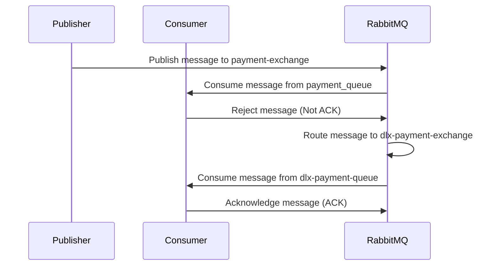

# POC DLX

This is a proof of concept of a **Dead Queue Letter** implementation (DLX) written in Go.

## Pre-requisites

install and run RabbitMQ

## Flow of the application

1. The application will create a exchange named `payment-exchange` and a DLX exchange named `dlx-payment-exchange`.
2. The application will create a queue named `payment-queue` and bind it to the `payment-exchange` exchange.
3. The application will create a queue named `dlx-payment-queue` and bind it to the `dlx-payment-exchange` exchange.
4. The application will publish a message to the `payment-exchange` exchange.
5. The message will be routed to the `payment-queue` queue.
6. The consumer will consume the message from the `payment-queue` queue and reject it (Not ACK).
7. The message will be routed to the `dlx-payment-queue` queue.
8. The consumer will consume the message from the `dlx-payment-queue` queue and acknowledge it (ACK).

